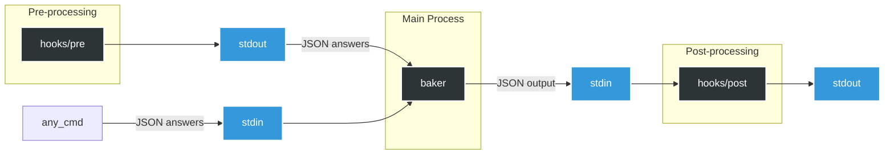

# What is Baker?

<div align="center">
  
  <p><strong>Baker</strong> is a command-line tool that helps you quickly <a href="https://en.wikipedia.org/wiki/Scaffold_(programming)">scaffold</a> new projects. It supports language-independent <a href="#using-hooks">hooks</a> for automating routine tasks. Baker is written in Rust and distributed as a standalone binary. Precompiled binaries are available for popular platforms on the <a href="https://github.com/aliev/baker/releases">releases page</a>.</p>
</div>

## Table of Contents

- [Installation](#installation)
- [Project template example](#project-template-example)
  - [baker.yaml File](#bakeryaml-file)
  - [Files with .baker.j2 extension](#files-with-bakerj2-extension)
  - [Templated File Names](#templated-file-names)
  - [.bakerignore File](#bakerignore-file)
- [Recipes](#recipes)
  - [Passing Default Answers](#passing-default-answers)
  - [Debugging Templates](#debugging-templates)
- [Hooks](#hooks)
  - [Customizing Hook Filenames](#customizing-hook-filenames)
  - [Available Platform Variables](#available-platform-variables)
- [Questions](#questions)
  - [Single-Input](#single-input)
  - [Yes / No](#yes--no)
  - [Single Choice](#single-choice)
  - [Multiple Choice](#multiple-choice)
  - [JSON Complex Type](#json-complex-type)
  - [YAML Complex Type](#yaml-complex-type)
  - [Validation](#validation)
    - [Required Field Validation](#required-field-validation)
    - [Numeric Value Validation](#numeric-value-validation)
    - [Pattern Matching with Regular Expressions](#pattern-matching-with-regular-expressions)
  - [Conditional questions](#conditional-questions)
- [Comparing Baker to other project generators](#comparing-baker-to-other-project-generators)

## Installation

You can install Baker using one of the following methods:

### Install via Homebrew (macOS)

```bash
brew install aliev/tap/baker
```

### Install prebuilt binaries via shell script (Linux/macOS)

```bash
curl --proto '=https' --tlsv1.2 -LsSf https://github.com/aliev/baker/releases/download/v0.6.0/baker-installer.sh | sh
```

### Install prebuilt binaries via PowerShell script (Windows)

```powershell
powershell -ExecutionPolicy Bypass -c "irm https://github.com/aliev/baker/releases/download/v0.6.0/baker-installer.ps1 | iex"
```

Prebuilt binaries for all supported platforms are available on the [releases page](https://github.com/aliev/baker/releases).

## Project template example

To get started, you can use the [examples/demo](examples/demo) template, which demonstrates the core features of Baker:

```
│   Template configuration.
├── baker.yaml
│
│   The content of files with the `.baker.j2` extension will be processed by the templating engine
├── CONTRIBUTING.md.baker.j2
│
│   any other files will be copied as is,
├── README.md
│
│   unless they are listed in .bakerignore.
├── .bakerignore
│
│   File names can be templated
├── {{project_slug}}
│   └── __init__.py
│
│   any template features can be used, such as conditions:
└── tests
    └── __init__.py
```

As a quick start, you can run the following command to generate a project:

```
baker examples/demo my-project
```

Each component of this template is described in detail below.

### `baker.yaml` File

The `baker.yaml` file defines the directory as a template. It contains template settings and [questions](#question) to be prompted to the user:

```yaml
schemaVersion: v1

questions:
  project_name:
    type: str
    help: Please enter the name of your project

  project_author:
    type: str
    help: "Please enter the author's name for {{project_name}}"

  project_slug:
    type: str
    help: Please enter the project slug (or press Enter to use the default)
    default: "{{ project_name|lower|replace(' ', '_') }}"

  use_tests:
    type: bool
    help: Will your project include tests?
    default: true
```

The values of the `help` and `default` keys can include templates for value substitution. Each subsequent question has access to the answers of the previous ones as demonstrated in `project_author` and `project_slug`.

In addition to YAML, Baker also supports JSON due to its backward compatibility with JSON. If multiple configuration files exist in the template directory, Baker will load them in the following order of priority: `baker.json`, `baker.yaml`, and `baker.yml`.

### Files with `.baker.j2` extension

The content of files with the `.baker.j2` extension will be processed by the templating engine and written to the target directory. The resulting files in the target directory will not include the `.baker.j2` extension in their names.

The content of such files can include the `questions` keys, which will be replaced by the corresponding user-provided answers during processing. Baker uses the MiniJinja this purpose. For more details on the syntax and capabilities of the templating engine, please refer to the [MiniJinja](https://docs.rs/minijinja/latest/minijinja/) documentation.

**Example:**

**Content of CONTRIBUTING.md.baker.j2**

```
  # {{project_name}}
  Author: {{project_author}}
```

**Processed file in target directory: CONTRIBUTING.md**

```
Content of CONTRIBUTING.md:
  # MyAwesomeProject
  Author: John Doe
```

### Templated File Names

File and directory names can be templated to dynamically adjust based on user input.

**Example:**

```yaml
project_name:
  type: str
  help: Please enter the name of your project

project_slug:
  type: str
  help: Please enter the project slug (or press Enter to use the default)
  default: "{{ project_name|lower|replace(' ', '_') }}"
```

```
├── {{project_slug}}
│ └── __init__.py
```

This will create a directory named according to the value of the `project_slug` provided by the user.

---

File and directory names can include conditions that control their creation. If a condition evaluates to `false`, the corresponding file or directory will not be created. This feature is especially useful with [Yes / No](#yes--no) type questions, allowing you to dynamically include or exclude specific files and directories based on user responses.

**Example:**

```yaml
use_tests:
  type: bool
  help: Will your project include tests?
  default: true
```

```
└── tests
    └── __init__.py
```

In this example, if the user answers "no" the `tests` directory will not be created.

### `.bakerignore` File

The `.bakerignore` file in the template root is used to exclude files and directories from being copied from the template. Bakerignore uses [Globset syntax](https://docs.rs/globset/latest/globset/#syntax).

By default, Baker ignores the following files and patterns:

```rust
const DEFAULT_IGNORE_PATTERNS: &[&str] = &[
    ".git/**",
    ".git",
    ".hg/**",
    ".hg",
    ".svn/**",
    ".svn",
    "**/.DS_Store",
    ".bakerignore",
    "hooks",
    "hooks/**",
    "baker.yaml",
    "baker.yml",
    "baker.json",
];
```

## Recipes

### Passing Default Answers

Passing default answers can be useful when the answers are already known, such as in a CI/CD pipeline.

Default answers can be provided using the `--answers` option.

**Example**

```bash
# Alternatively, use --answers='{"name": "John"}'
echo '{"name": "John"}' | baker template my-project --answers=-
```

```yaml
schemaVersion: v1
questions:
  name:
    type: str
    help: What is your name?
```

The provided answer will be used as the default in the user prompt:

```
What is your name? [John]:
```

To skip the prompt entirely, you can use the `ask_if` attribute:

```yaml
schemaVersion: v1
questions:
  name:
    type: str
    help: What is your name?
    # Skips the prompt if "name" was provided in answers
    ask_if: name is not defined or name == ''
```

A detailed description of the `ask_if` key can be found in the [Conditional Questions](#conditional-questions) section.

### Debugging Templates

Since Baker uses MiniJinja, it benefits from all MiniJinja features, including debugging. You can use the `debug()` function to inspect the current context.

**Example**

```yaml
schemaVersion: v1
questions:
  first_name:
    type: str
    help: What is your name?
  last_name:
    type: str
    help: "Hello, {{first_name}}. What is your last name?"
  debug:
    type: str
    help: "{{debug()}}"
```

When you run the template, the `debug()` function will output the current context:

```
baker example out
What is your name?: aaa
Hello, aaa. What is your last name?: bbb
State {
    name: "temp",
    current_block: None,
    auto_escape: None,
    ctx: {
        "first_name": "aaa",
        "last_name": "bbb",
    },
    env: Environment {
        globals: {
            "debug": minijinja::functions::builtins::debug,
            "dict": minijinja::functions::builtins::dict,
            "namespace": minijinja::functions::builtins::namespace,
            "range": minijinja::functions::builtins::range,
        },
        tests: [
            "!=",
            "<",
            "<=",
            "==",
            ">",
            ">=",
            "boolean",
            "defined",
            "divisibleby",
...
```

This output provides a detailed view of the current context, including defined variables, their values, and available functions, helping you troubleshoot and debug your templates effectively.

## Hooks

Hooks are useful for performing routine tasks before (pre-hook) or after (post-hook) project generation.

Baker executes hooks as separate processes, which makes them language-independent.

For a hook to be executed, it must meet two requirements:

1. It must be located in the template directory `template_root/hooks/` and named according to the `pre_hook_filename` or `post_hook_filename` specified in the configuration.
2. It must be an executable file (`chmod +x template_root/hooks/<hook_filename>`).

When generating a project containing a hook, Baker will issue a warning:

```
baker examples/hooks out
WARNING: This template contains the following hooks that will execute commands on your system:
examples/hooks/hooks/post
Do you want to run these hooks? [y/N]
```

This warning can be omitted by using the `--skip-confirms=hooks` parameter.

The `pre` hook can generate answers and pass them to `baker` through `stdout`:

```python
#!/usr/bin/env python
import json

if __name__ == "__main__":
    # Passing the default answers to baker
    json.dump({"name": "John"}, sys.stdout)
```

The `post` hook can consume the answers, which will be passed by `baker` to the `stdin` of the `post` hook. The answers can be parsed as follows:

```python
#!/usr/bin/env python
import json
import pathlib
from typing import Any, TypedDict

path = pathlib.Path()

class Input(TypedDict):
    answers: dict[str, Any]
    template_dir: str
    output_dir: str

if __name__ == "__main__":
    context: Input = json.load(sys.stdin)
    output_dir_path = path / context["output_dir"]
    template_dir_path = path / context["template_dir"]
```

The diagram below illustrates this process in more detail



### Customizing Hook Filenames

By default, Baker looks for hook scripts named `pre` and `post` in the `hooks` directory of your template. You can customize these filenames using the `pre_hook_filename` and `post_hook_filename` configuration options in your `baker.yaml` file:

```yaml
schemaVersion: v1

questions:
  # Your regular questions here...

# Custom hook filenames
pre_hook_filename: "setup-environment"
post_hook_filename: "finalize-project"
```

With this configuration, Baker will:

1. Look for a pre-hook script at `template_root/hooks/setup-environment`
2. Look for a post-hook script at `template_root/hooks/finalize-project`

Hook filenames also support template strings, which can be used to create platform-specific hooks:

```yaml
schemaVersion: v1

questions:
  license:
    type: str
    help: "Please select a licence for {{platform.os}}"
    default: MIT
    choices:
      - MIT
      - BSD
      - GPLv3
      - Apache Software License 2.0
      - Not open source

pre_hook_filename: "{{platform.family}}/pre"
post_hook_filename: "{{platform.family}}/post"
```

This configuration allows you to organize hooks by platform. For example:

```
hooks/
├── unix/
│   ├── pre
│   └── post
└── windows/
    ├── pre
    └── post
```

Baker will automatically select the appropriate hook based on the current platform.

### Available Platform Variables

Baker provides these platform variables that can be used in templates and hook filenames:

- `platform.os` - Operating system name (e.g., "linux", "macos", "windows")
- `platform.family` - OS family (e.g., "unix", "windows")
- `platform.arch` - CPU architecture (e.g., "x86_64", "aarch64")

You can use these variables in any template, including hook filenames, questions, help text, defaults, etc.

## Questions

Baker supports various question components, which are described below.

### Single-Input

Single Input prompts the user to enter a text value.

#### Example

```yaml
schemaVersion: v1

questions:
  readme_content:
    type: str
    help: Please enter the content for CONTRIBUTING.md
    default: My super duper project
```

- **`type`**: Must be `str`.
- **`help`**: Should be a string, optionally containing a `minijinja` template.
- **`default`**: Should be a string, optionally containing a `minijinja` template.

#### Result

```
Please enter the content for CONTRIBUTING.md []:
```

### Yes / No

#### Example

```yaml
schemaVersion: v1

questions:
  include_tests:
    type: bool
    help: Do you want to include tests in the generated project?
    default: true
```

- **`type`**: Must be `bool`.
- **`help`**: Should be a string, optionally containing a `minijinja` template.
- **`default`**: Should be a boolean value, defaulting to `false`.

#### Result

```
Do you want to include tests in the generated project? [Y/n]
```

### Single Choice

#### Example

```yaml
schemaVersion: v1

questions:
  favourite_language:
    type: str
    help: What is your favorite programming language?
    default: Rust
    choices:
      - Python
      - Rust
      - Go
      - TypeScript
```

- **`type`**: Must be `str`.
- **`help`**: Should be a string, optionally containing a `minijinja` template.
- **`choices`**: Should be a list of strings.
- **`default`**: Should be a string, optionally containing a `minijinja` template.

#### Result

```
What is your favorite programming language?:
  Python
> Rust
  Go
  TypeScript
```

### Multiple Choice

#### Example

```yaml
schemaVersion: v1

questions:
  favourite_language:
    type: str
    help: What are your favorite programming languages?
    multiselect: true
    default:
      - Python
      - Rust
    choices:
      - Python
      - Rust
      - Go
      - TypeScript
```

- **`type`**: Must be `str`.
- **`help`**: Should be a string, optionally containing a `minijinja` template.
- **`multiselect`**: Must be `true` to enable multiple choice.
- **`default`**: Should be a list of strings.
- **`choices`**: Should be a list of strings.

#### Result

```
What are your favorite programming languages?:
  [x] Python
> [x] Rust
  [ ] Go
  [ ] TypeScript
```

### JSON Complex Type

The JSON type allows you to collect structured data from the user in JSON format. This is useful for configuration files, environment settings, and other structured data.

#### Example

```yaml
schemaVersion: v1

questions:
  database_config:
    type: json
    help: Configure your database settings
    schema: |
      {
        "type": "object",
        "required": ["engine", "host", "port"],
        "properties": {
          "engine": {
            "type": "string",
            "enum": ["postgresql", "mysql", "sqlite", "mongodb"]
          },
          "host": {
            "type": "string"
          },
          "port": {
            "type": "integer",
            "minimum": 1,
            "maximum": 65535
          }
        }
      }
    default: |
      {
        "engine": "postgresql",
        "host": "localhost",
        "port": 5432
      }
```

- **`type`**: Must be `json`.
- **`help`**: Should be a string, optionally containing a `minijinja` template.
- **`schema`**: Optional JSON Schema for validation. Follows the [JSON Schema standard](https://json-schema.org/).
- **`default`**: JSON object, can be provided as a string or native YAML object.

#### Result

When prompted for JSON input, the user is given multiple options:

1. Open in external text editor
2. Enter multi-line input in console

```
Configure your database settings - Choose input method:
> Use text editor
  Enter inline
```

JSON data can be accessed in templates like any other nested structure:

```
Connection string: {{ database_config.engine }}://{{ database_config.host }}:{{ database_config.port }}
```

### YAML Complex Type

The YAML type works similarly to the JSON type but uses YAML syntax, which is more readable and less verbose.

#### Example

```yaml
schemaVersion: v1

questions:
  environments:
    type: yaml
    help: Configure your deployment environments
    default:
      development:
        url: http://localhost:8000
        debug: true
      staging:
        url: https://staging.example.com
        debug: true
      production:
        url: https://example.com
        debug: false
```

- **`type`**: Must be `yaml`.
- **`help`**: Should be a string, optionally containing a `minijinja` template.
- **`schema`**: Optional JSON Schema for validation (same format as for JSON type).
- **`default`**: YAML data, can be provided as a string or native YAML object.

#### Result

Similar to JSON input, the user is prompted to choose an input method. YAML is particularly useful for configuration data due to its readability:

```
Define your environments:

development:
  url: http://localhost:8000
  debug: true
staging:
  url: https://staging.example.com
  debug: true
production:
  url: https://example.com
  debug: false
```

Template usage:

```

[{{ env_name }}]
URL={{ env_config.url }}
DEBUG={{ env_config.debug }}


```

### Validation

Baker supports answer validation using the `valid_if` and `error_message` attributes. The `valid_if` attribute uses MiniJinja's expression language to validate user input, while `error_message` provides feedback when validation fails.

#### Required Field Validation

Ensure a field is not empty:

```yaml
schemaVersion: v1

questions:
  age:
    type: str
    help: "Enter your age"
    valid_if: "age"
    error_message: "Value cannot be empty"
```

#### Numeric Value Validation

Check if a numeric value meets certain criteria:

```yaml
schemaVersion: v1

questions:
  age:
    type: str
    help: "Enter your age"
    valid_if: "age|int >= 18"
    error_message: "You must be at least 18 years old. You entered {{age}}."
```

The error message can include template variables to provide context about the invalid input.

#### Pattern Matching with Regular Expressions

Combine regex pattern matching with numeric validation:

```yaml
schemaVersion: v1

questions:
  age:
    type: str
    help: "Enter your age"
    valid_if: "(age | regex('[0-9]')) and (age|int >= 18)"
    error_message: "You must be at least 18 years old. You entered {{age}}."
```

This example validates that:

1. The input matches a numeric pattern using regex
2. The numeric value is at least 18

If validation fails, Baker will:

1. Display the error message
2. Clear the invalid answer
3. Prompt the user to try again

### Conditional questions

The `ask_if` attribute is used to control the display of a question, using [expression language](https://docs.rs/minijinja/latest/minijinja/#expression-usage) from MiniJinja. It enables conditional logic to determine whether a question should be prompted based on user input or other contextual factors. In the following example, the `py_framework` question is only prompted if the user selects `Python` as the programming language in the `language` question:

```yaml
schemaVersion: v1

questions:
  language:
    type: str
    help: What is your programming language?
    default: Rust
    choices:
      - Python
      - Rust
      - Go
      - TypeScript
  py_framework:
    type: str
    help: What is your Python framework?
    choices:
      - Django
      - FastAPI
      - Pyramid
      - Tornado
    ask_if: "language == 'Python'"
```

## Comparing Baker to other project generators

| Feature                                      | Baker                                                                          | Kickstart      | cargo-generate          | Copier                 | Cookiecutter              | Yeoman                        |
| -------------------------------------------- | ------------------------------------------------------------------------------ | -------------- | ----------------------- | ---------------------- | ------------------------- | ----------------------------- |
| 🟢 **Structured JSON/YAML input**            | ✅ Native support with validation and schema                                   | ❌             | ❌                      | ⚠️ Limited             | ❌                        | ⚠️ Custom logic required      |
| 🟢 **JSON Schema validation**                | ✅ Enforce data validity with standard JSON Schema                             | ❌             | ❌                      | ❌                     | ❌                        | ⚠️ Custom logic required      |
| 🟢 **Complex data editing modes**            | ✅ Editor/Console/File input for structured data                               | ❌             | ❌                      | ❌                     | ❌                        | ❌                            |
| 🟢 **In-template debug() support**           | ✅ Use `{{ debug() }}` to inspect context                                      | ❌             | ❌                      | ❌                     | ❌                        | ⚠️ Only via console.log       |
| 🟢 **Structured hook communication**         | ✅ pre/post hooks exchange structured JSON via stdin/stdout                    | ❌             | ❌                      | ❌                     | ❌                        | ❌                            |
| 🟢 **Safe hook execution**                   | ✅ Warns before executing hooks                                                | ❌             | ❌                      | ❌                     | ❌                        | ⚠️ Depends on generator       |
| 🟢 **Schema versioning for config**          | ✅ Schema version ensures backward compatibility across Baker versions         | ✅             | ❌                      | ❌                     | ❌                        | ❌                            |
| 🟢 **YAML & JSON config support**            | ✅ Supports `yaml` **and** `json` configurations                               | ❌ Only TOML   | ❌ Only TOML            | ❌ Only YAML           | ❌ Only JSON              | ❌ In JS code                 |
| 🟢 **Platform-specific hooks**               | ✅ Use `{{platform.family}}/pre` etc. for OS-aware logic                       | ❌             | ⚠️ Limited via Rhai     | ❌                     | ❌                        | ⚠️ Custom logic required      |
| 🟢 **CI/CD-friendly answers piping**         | ✅ `--answers=-` or echo JSON into CLI                                         | ❌             | ⚠️ Partial              | ✅ Via pre-filled YAML | ⚠️ `--no-input` only      | ❌ Manual scripting           |
| 🟢 **Lightweight & Fast**                    | ✅ Rust binary, no runtime dependencies                                        | ✅ Rust binary | ✅ Rust binary          | ❌ Requires Python     | ❌ Requires Python        | ❌ Requires Node.js           |
| 🟢 **Simple CLI Interface**                  | ✅ `baker <template> <output>` + `--answers`, `--skip-confirms`                | ✅ Simple      | ❌ Requires Cargo usage | ❌ More verbose        | ✅ Simple                 | ❌ Requires generator install |
| 🟢 **Language-agnostic hooks**               | ✅ Hooks can be in _any_ language (Bash, Python, etc.)                         | ✅ Yes         | ⚠️ Only Rhai scripting  | ✅ Yes                 | ✅ Yes                    | ❌ Only JS                    |
| 🟢 **Templated file/dir names**              | ✅ Full MiniJinja templating in names & conditions                             | ✅ Yes         | ✅ Yes                  | ✅ Yes                 | ✅ Yes                    | ✅ Via JS logic               |
| 🟢 **Templated prompts & defaults**          | ✅ Dynamic defaults using MiniJinja, conditional via `ask_if`                  | ✅ Yes         | ⚠️ Limited              | ✅ Full Jinja          | ❌ Static only            | ✅ Full control in JS         |
| 🟢 **Glob-based ignore file**                | ✅ `.bakerignore` with advanced Globset syntax                                 | ✅ Yes         | ✅ Yes                  | ✅ `_exclude`          | ⚠️ `_copy_without_render` | ❌ Manual filter in code      |
| 🟢 **Cross-platform binaries**               | ✅ Precompiled for Linux, macOS, Windows                                       | ✅ Yes         | ✅ Yes                  | ✅ Yes                 | ✅ Yes                    | ✅ Yes                        |
| 🟢 **Language-agnostic scaffolding**         | ✅ Works with any language / stack                                             | ✅ Yes         | ❌ Rust-focused         | ✅ Yes                 | ✅ Yes                    | ⚠️ JS-centric                 |
| 🟢 **Answers accessible in later questions** | ✅ All previous answers available via MiniJinja in `default`, `help`, `ask_if` | ⚠️ Limited     | ⚠️ Partial (via Rhai)   | ✅ Yes (Jinja context) | ❌                        | ✅ Full control in JS         |
| 🟢 **Templated engine**                      | ✅ Fast, safe, embedded Jinja2-like templating in Rust                         | Tera           | Liquid                  | Jinja2                 | Jinja2                    | EJS                           |

### ℹ️ Disclaimer

This comparison was made based on available documentation. If you notice any **inaccuracies or outdated information**, please [create an issue](https://github.com/aliev/baker/issues) — I'll be happy to update the table accordingly.
