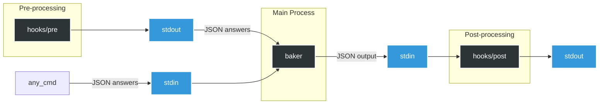

# What is Baker?

<div align="center">
  
  <p><strong>Baker</strong> is a command-line tool that helps you quickly <a href="https://en.wikipedia.org/wiki/Scaffold_(programming)">scaffold</a> new projects. It supports language-independent <a href="#using-hooks">hooks</a> for automating routine tasks. Baker is written in Rust and distributed as a standalone binary. Precompiled binaries are available for popular platforms on the <a href="https://github.com/aliev/baker/releases">releases page</a>.</p>
</div>

## Project template example

To get started, you can use the [examples/demo](examples/demo) template, which demonstrates the core features of Baker:

```
│   Template configuration.
├── baker.yaml
│
│   The content of files with the `.baker.j2` extension will be processed by the templating engine
├── CONTRIBUTING.md.baker.j2
│
│   any other files will be copied as is,
├── README.md
│
│   unless they are listed in .bakerignore.
├── .bakerignore
│
│   File names can be templated
├── {{project_slug}}
│   └── __init__.py
│
│   any template features can be used, such as conditions:
└── tests
    └── __init__.py
```

As a quick start, you can run the following command to generate a project:

```
baker examples/demo my-project
```

Each component of this template is described in detail below.

### `baker.yaml` File

The `baker.yaml` file defines the directory as a template. It contains template settings and [questions](#question) to be prompted to the user:

```yaml
schemaVersion: v1

questions:
  project_name:
    type: str
    help: Please enter the name of your project

  project_author:
    type: str
    help: "Please enter the author's name for {{project_name}}"

  project_slug:
    type: str
    help: Please enter the project slug (or press Enter to use the default)
    default: "{{ project_name|lower|replace(' ', '_') }}"

  use_tests:
    type: bool
    help: Will your project include tests?
    default: true
```

The values of the `help` and `default` keys can include templates for value substitution. Each subsequent question has access to the answers of the previous ones as demonstrated in `project_author` and `project_slug`.

In addition to YAML, Baker also supports JSON due to its backward compatibility with JSON. If multiple configuration files exist in the template directory, Baker will load them in the following order of priority: `baker.json`, `baker.yaml`, and `baker.yml`.

### Files with `.baker.j2` extension

The content of files with the `.baker.j2` extension will be processed by the templating engine and written to the target directory. The resulting files in the target directory will not include the `.baker.j2` extension in their names.

The content of such files can include the `questions` keys, which will be replaced by the corresponding user-provided answers during processing. Baker uses the MiniJinja this purpose. For more details on the syntax and capabilities of the templating engine, please refer to the [MiniJinja](https://docs.rs/minijinja/latest/minijinja/) documentation.

**Example:**

**Content of CONTRIBUTING.md.baker.j2**

```
  # {{project_name}}
  Author: {{project_author}}
```

**Processed file in target directory: CONTRIBUTING.md**

```
Content of CONTRIBUTING.md:
  # MyAwesomeProject
  Author: John Doe
```

### Templated File Names

File and directory names can be templated to dynamically adjust based on user input.

**Example:**

```yaml
project_name:
  type: str
  help: Please enter the name of your project

project_slug:
  type: str
  help: Please enter the project slug (or press Enter to use the default)
  default: "{{ project_name|lower|replace(' ', '_') }}"
```

```
├── {{project_slug}}
│ └── __init__.py
```

This will create a directory named according to the value of the `project_slug` provided by the user.

---

File and directory names can include conditions that control their creation. If a condition evaluates to `false`, the corresponding file or directory will not be created. This feature is especially useful with [Yes / No](#yes--no) type questions, allowing you to dynamically include or exclude specific files and directories based on user responses.

**Example:**

```yaml
use_tests:
  type: bool
  help: Will your project include tests?
  default: true
```

```
└── tests
    └── __init__.py
```

In this example, if the user answers "no" the `tests` directory will not be created.

### `.bakerignore` File

The `.bakerignore` file in the template root is used to exclude files and directories from being copied from the template. Bakerignore uses [Globset syntax](https://docs.rs/globset/latest/globset/#syntax).

By default, Baker ignores the following files and patterns:

```rust
const DEFAULT_IGNORE_PATTERNS: &[&str] = &[
    ".git/**",
    ".git",
    ".hg/**",
    ".hg",
    ".svn/**",
    ".svn",
    "**/.DS_Store",
    ".bakerignore",
    "hooks",
    "hooks/**",
    "baker.yaml",
    "baker.yml",
    "baker.json",
];
```

## Recipes

### Passing Default Answers

Passing default answers can be useful when the answers are already known, such as in a CI/CD pipeline.

Default answers can be provided using the `--answers` option.

**Example**

```bash
# Alternatively, use --answers='{"name": "John"}'
echo '{"name": "John"}' | baker template my-project --answers=-
```

```yaml
schemaVersion: v1
questions:
  name:
    type: str
    help: What is your name?
```

The provided answer will be used as the default in the user prompt:

```
What is your name? [John]:
```

To skip the prompt entirely, you can use the `ask_if` attribute:

```yaml
schemaVersion: v1
questions:
  name:
    type: str
    help: What is your name?
    # Skips the prompt if "name" was provided in answers
    ask_if: name is not defined or name == ''
```

A detailed description of the `ask_if` key can be found in the [Conditional Questions](#conditional-questions) section.

### Debugging Templates

Since Baker uses MiniJinja, it benefits from all MiniJinja features, including debugging. You can use the `debug()` function to inspect the current context.

**Example**

```yaml
schemaVersion: v1
questions:
  first_name:
    type: str
    help: What is your name?
  last_name:
    type: str
    help: "Hello, {{first_name}}. What is your last name?"
  debug:
    type: str
    help: "{{debug()}}"
```

When you run the template, the `debug()` function will output the current context:

```
baker example out
What is your name?: aaa
Hello, aaa. What is your last name?: bbb
State {
    name: "temp",
    current_block: None,
    auto_escape: None,
    ctx: {
        "first_name": "aaa",
        "last_name": "bbb",
    },
    env: Environment {
        globals: {
            "debug": minijinja::functions::builtins::debug,
            "dict": minijinja::functions::builtins::dict,
            "namespace": minijinja::functions::builtins::namespace,
            "range": minijinja::functions::builtins::range,
        },
        tests: [
            "!=",
            "<",
            "<=",
            "==",
            ">",
            ">=",
            "boolean",
            "defined",
            "divisibleby",
...
```

This output provides a detailed view of the current context, including defined variables, their values, and available functions, helping you troubleshoot and debug your templates effectively.

## Hooks

Hooks are useful for performing routine tasks before (pre-hook) or after (post-hook) project generation.

Baker executes hooks as separate processes, which makes them language-independent.

For a hook to be executed, it must meet two requirements:

1. It must be located in the template directory `template_root/hooks/` and named either `post` or `pre`.
2. It must be an executable file (`chmod +x template_root/hooks/post`).

When generating a project containing a hook, Baker will issue a warning:

```
baker examples/hooks out
WARNING: This template contains the following hooks that will execute commands on your system:
examples/hooks/hooks/post
Do you want to run these hooks? [y/N]
```

This warning can be omitted by using the `--skip-confirms=hooks` parameter.

The `pre` hook can generate answers and pass them to `baker` through `stdout`:

```python
#!/usr/bin/env python
import json

if __name__ == "__main__":
    # Passing the default answers to baker
    json.dump({"name": "John"}, sys.stdout)
```

The `post` hook can consume the answers, which will be passed by `baker` to the `stdin` of the `post` hook. The answers can be parsed as follows:

```python
#!/usr/bin/env python
import json
import pathlib
from typing import Any, TypedDict

path = pathlib.Path()

class Input(TypedDict):
    answers: dict[str, Any]
    template_dir: str
    output_dir: str

if __name__ == "__main__":
    context: Input = json.load(sys.stdin)
    output_dir_path = path / context["output_dir"]
    template_dir_path = path / context["template_dir"]
```

The diagram below illustrates this process in more detail



There is an example [example](examples/hooks) of a simple template using a post-hook: it reads the user's response for the selected license, retrieves the corresponding license content from the available license files, and writes it to the target directory as the `LICENSE` file.

## Questions

Baker supports various question components, which are described below.

### Single-Input

Single Input prompts the user to enter a text value.

#### Example

```yaml
schemaVersion: v1

questions:
  readme_content:
    type: str
    help: Please enter the content for CONTRIBUTING.md
    default: My super duper project
```

- **`type`**: Must be `str`.
- **`help`**: Should be a string, optionally containing a `minijinja` template.
- **`default`**: Should be a string, optionally containing a `minijinja` template.

#### Result

```
Please enter the content for CONTRIBUTING.md []:
```

### Yes / No

#### Example

```yaml
schemaVersion: v1

questions:
  include_tests:
    type: bool
    help: Do you want to include tests in the generated project?
    default: true
```

- **`type`**: Must be `bool`.
- **`help`**: Should be a string, optionally containing a `minijinja` template.
- **`default`**: Should be a boolean value, defaulting to `false`.

#### Result

```
Do you want to include tests in the generated project? [Y/n]
```

### Single Choice

#### Example

```yaml
schemaVersion: v1

questions:
  favourite_language:
    type: str
    help: What is your favorite programming language?
    default: Rust
    choices:
      - Python
      - Rust
      - Go
      - TypeScript
```

- **`type`**: Must be `str`.
- **`help`**: Should be a string, optionally containing a `minijinja` template.
- **`choices`**: Should be a list of strings.
- **`default`**: Should be a string, optionally containing a `minijinja` template.

#### Result

```
What is your favorite programming language?:
  Python
> Rust
  Go
  TypeScript
```

### Multiple Choice

#### Example

```yaml
schemaVersion: v1

questions:
  favourite_language:
    type: str
    help: What are your favorite programming languages?
    multiselect: true
    default:
      - Python
      - Rust
    choices:
      - Python
      - Rust
      - Go
      - TypeScript
```

- **`type`**: Must be `str`.
- **`help`**: Should be a string, optionally containing a `minijinja` template.
- **`multiselect`**: Must be `true` to enable multiple choice.
- **`default`**: Should be a list of strings.
- **`choices`**: Should be a list of strings.

#### Result

```
What are your favorite programming languages?:
  [x] Python
> [x] Rust
  [ ] Go
  [ ] TypeScript
```

### Conditional questions

The `ask_if` attribute is used to control the display of a question, using [expression language](https://docs.rs/minijinja/latest/minijinja/#expression-usage) from MiniJinja. It enables conditional logic to determine whether a question should be prompted based on user input or other contextual factors. In the following example, the `py_framework` question is only prompted if the user selects `Python` as the programming language in the `language` question:

```yaml
schemaVersion: v1

questions:
  language:
    type: str
    help: What is your programming language?
    default: Rust
    choices:
      - Python
      - Rust
      - Go
      - TypeScript
  py_framework:
    type: str
    help: What is your Python framework?
    choices:
      - Django
      - FastAPI
      - Pyramid
      - Tornado
    ask_if: "language == 'Python'"
```
